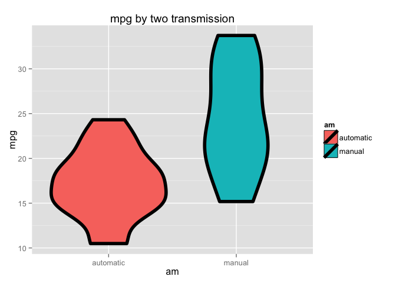
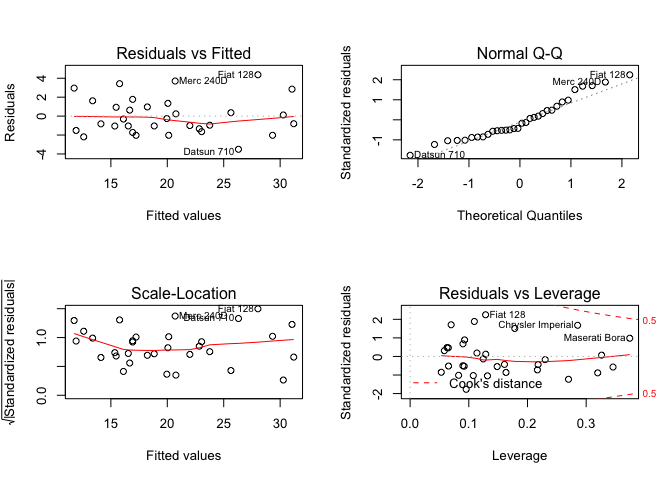

# Using Regression Models Explor Motor Trend
Luna Gui  
23 January 2015  

## Summary
We work for Motor Trend, a magazine about the automobile industry. Looking at a data set of a collection of cars, they are interested in exploring the relationship between a set of variables and miles per gallon (MPG) (outcome). They are particularly interested in the following two questions:  
  
- “Is an automatic or manual transmission better for MPG”  
- "Quantify the MPG difference between automatic and manual transmissions"  

## Load and Explor Data  
First, we load the mtcars data and perform some basic exploratory data analyses.

```r
library(UsingR)
```

```
## Loading required package: MASS
## Loading required package: HistData
## Loading required package: Hmisc
## Loading required package: grid
## Loading required package: lattice
## Loading required package: survival
## Loading required package: splines
## Loading required package: Formula
## 
## Attaching package: 'Hmisc'
## 
## The following objects are masked from 'package:base':
## 
##     format.pval, round.POSIXt, trunc.POSIXt, units
## 
## Loading required package: quantreg
## Loading required package: SparseM
## 
## Attaching package: 'SparseM'
## 
## The following object is masked from 'package:base':
## 
##     backsolve
## 
## 
## Attaching package: 'quantreg'
## 
## The following object is masked from 'package:Hmisc':
## 
##     latex
## 
## The following object is masked from 'package:survival':
## 
##     untangle.specials
## 
## 
## Attaching package: 'UsingR'
## 
## The following object is masked from 'package:survival':
## 
##     cancer
```

```r
data(mtcars)
str(mtcars)
```

```
## 'data.frame':	32 obs. of  11 variables:
##  $ mpg : num  21 21 22.8 21.4 18.7 18.1 14.3 24.4 22.8 19.2 ...
##  $ cyl : num  6 6 4 6 8 6 8 4 4 6 ...
##  $ disp: num  160 160 108 258 360 ...
##  $ hp  : num  110 110 93 110 175 105 245 62 95 123 ...
##  $ drat: num  3.9 3.9 3.85 3.08 3.15 2.76 3.21 3.69 3.92 3.92 ...
##  $ wt  : num  2.62 2.88 2.32 3.21 3.44 ...
##  $ qsec: num  16.5 17 18.6 19.4 17 ...
##  $ vs  : num  0 0 1 1 0 1 0 1 1 1 ...
##  $ am  : num  1 1 1 0 0 0 0 0 0 0 ...
##  $ gear: num  4 4 4 3 3 3 3 4 4 4 ...
##  $ carb: num  4 4 1 1 2 1 4 2 2 4 ...
```

```r
colSums(is.na(mtcars))
```

```
##  mpg  cyl disp   hp drat   wt qsec   vs   am gear carb 
##    0    0    0    0    0    0    0    0    0    0    0
```
  
We get the basic imformation of data. If we treat mpg as our outcome, we have 10 variables may influnce this outcome. We intersted in automatic or manual transmission which is the am variable.  

```r
library(ggplot2)
```

```
## 
## Attaching package: 'ggplot2'
## 
## The following object is masked from 'package:UsingR':
## 
##     movies
```

```r
mtcars$am <- factor(as.character(mtcars$am), levels = c(0,1), labels = c("automatic", "manual"))
g <-ggplot(mtcars, aes(x = am, y=mpg, fill = am)) 
g  + geom_violin(col = "black", size = 2) + labs(title = "mpg by two transmission")
```

 
  
**It looks manual transmission better than automatic transmission.**  


```r
fit <- lm(mpg ~ am, mtcars)
summary(fit)
```

```
## 
## Call:
## lm(formula = mpg ~ am, data = mtcars)
## 
## Residuals:
##    Min     1Q Median     3Q    Max 
## -9.392 -3.092 -0.297  3.244  9.508 
## 
## Coefficients:
##             Estimate Std. Error t value Pr(>|t|)    
## (Intercept)    17.15       1.12   15.25  1.1e-15 ***
## ammanual        7.24       1.76    4.11  0.00029 ***
## ---
## Signif. codes:  0 '***' 0.001 '**' 0.01 '*' 0.05 '.' 0.1 ' ' 1
## 
## Residual standard error: 4.9 on 30 degrees of freedom
## Multiple R-squared:  0.36,	Adjusted R-squared:  0.338 
## F-statistic: 16.9 on 1 and 30 DF,  p-value: 0.000285
```
The result indicates the averge mpg of manual transmission is 7.24 higher than that of automatic transmission (17.15 as intercept) with a p-value less than 0.1% significance. The adjusted R2 value(0.3385) indicates that the model explains only 34% of the variations. It’s a very low value.
  
## Model selection  


```r
fitall <- lm(mpg ~ ., mtcars)
summary(fitall)
```

```
## 
## Call:
## lm(formula = mpg ~ ., data = mtcars)
## 
## Residuals:
##    Min     1Q Median     3Q    Max 
##  -3.45  -1.60  -0.12   1.22   4.63 
## 
## Coefficients:
##             Estimate Std. Error t value Pr(>|t|)  
## (Intercept)  12.3034    18.7179    0.66    0.518  
## cyl          -0.1114     1.0450   -0.11    0.916  
## disp          0.0133     0.0179    0.75    0.463  
## hp           -0.0215     0.0218   -0.99    0.335  
## drat          0.7871     1.6354    0.48    0.635  
## wt           -3.7153     1.8944   -1.96    0.063 .
## qsec          0.8210     0.7308    1.12    0.274  
## vs            0.3178     2.1045    0.15    0.881  
## ammanual      2.5202     2.0567    1.23    0.234  
## gear          0.6554     1.4933    0.44    0.665  
## carb         -0.1994     0.8288   -0.24    0.812  
## ---
## Signif. codes:  0 '***' 0.001 '**' 0.01 '*' 0.05 '.' 0.1 ' ' 1
## 
## Residual standard error: 2.65 on 21 degrees of freedom
## Multiple R-squared:  0.869,	Adjusted R-squared:  0.807 
## F-statistic: 13.9 on 10 and 21 DF,  p-value: 3.79e-07
```
If we fit all variable to regression model, The adjusted R2 value is good. But we have higher p value for almost all variable.


```r
pairs(mtcars)
```

 
  
The pairs plot shows that lots of variable have coraltion.   
  
We will try the Stepwise Algorithm  to select a better model but keeping am variable in the model:


```r
fit.step <- step(lm(mpg~ ., mtcars), trace=0, scope=list(lower=~am), direction="both")
summary(fit.step)
```

```
## 
## Call:
## lm(formula = mpg ~ wt + qsec + am, data = mtcars)
## 
## Residuals:
##    Min     1Q Median     3Q    Max 
## -3.481 -1.556 -0.726  1.411  4.661 
## 
## Coefficients:
##             Estimate Std. Error t value Pr(>|t|)    
## (Intercept)    9.618      6.960    1.38  0.17792    
## wt            -3.917      0.711   -5.51    7e-06 ***
## qsec           1.226      0.289    4.25  0.00022 ***
## ammanual       2.936      1.411    2.08  0.04672 *  
## ---
## Signif. codes:  0 '***' 0.001 '**' 0.01 '*' 0.05 '.' 0.1 ' ' 1
## 
## Residual standard error: 2.46 on 28 degrees of freedom
## Multiple R-squared:  0.85,	Adjusted R-squared:  0.834 
## F-statistic: 52.7 on 3 and 28 DF,  p-value: 1.21e-11
```
  
This model looks better. But we should check the cor between them.  

```r
par(mfrow = c(1,2))
plot(mtcars$am, mtcars$wt, ylab = "wt")
plot(mtcars$am, mtcars$qsec, ylab = "qsec")
```

 

```r
fitcor <- lm(mpg~ wt+am+qsec+wt*am, mtcars)
anova(fit, fit.step, fitcor)
```

```
## Analysis of Variance Table
## 
## Model 1: mpg ~ am
## Model 2: mpg ~ wt + qsec + am
## Model 3: mpg ~ wt + am + qsec + wt * am
##   Res.Df RSS Df Sum of Sq    F  Pr(>F)    
## 1     30 721                              
## 2     28 169  2       552 63.5 6.2e-11 ***
## 3     27 117  1        52 12.0  0.0018 ** 
## ---
## Signif. codes:  0 '***' 0.001 '**' 0.01 '*' 0.05 '.' 0.1 ' ' 1
```

```r
summary(fitcor)$adj.r.squared
```

```
## [1] 0.8804
```
We change the model a bit based on coralation between am and wt.  
The p-value is very low: we can then reject the null hypothesis (i.e. “Model are equals”) and claim that the model fitcor is best one. And the adjusted R2 value(0.8804219) indicates that the model explains 88% of the variations. It's quite good.  
  
We check the modle's Residual Analysis:

```r
par(mfrow = c(2,2))
plot(fitcor)
```

 
  
  The above figure is a residual plot of the selected model. Residuals seems to be uncorrelated with the fit, independent and (almost) identically distributed with mean zero.
  
## Result

```r
summary(fit.step)
```

```
## 
## Call:
## lm(formula = mpg ~ wt + qsec + am, data = mtcars)
## 
## Residuals:
##    Min     1Q Median     3Q    Max 
## -3.481 -1.556 -0.726  1.411  4.661 
## 
## Coefficients:
##             Estimate Std. Error t value Pr(>|t|)    
## (Intercept)    9.618      6.960    1.38  0.17792    
## wt            -3.917      0.711   -5.51    7e-06 ***
## qsec           1.226      0.289    4.25  0.00022 ***
## ammanual       2.936      1.411    2.08  0.04672 *  
## ---
## Signif. codes:  0 '***' 0.001 '**' 0.01 '*' 0.05 '.' 0.1 ' ' 1
## 
## Residual standard error: 2.46 on 28 degrees of freedom
## Multiple R-squared:  0.85,	Adjusted R-squared:  0.834 
## F-statistic: 52.7 on 3 and 28 DF,  p-value: 1.21e-11
```
Given the coefficients of our model, we can see manual cars have more effectient than automatic cars: they have mor 2.94 miles per galon (MPG) performance than automatic cars. This value can be obtained when we consider the weight (wt) and the “1/4 mile time” (qsec) variables of the cars of our dataset.


```r
summary(fitcor)
```

```
## 
## Call:
## lm(formula = mpg ~ wt + am + qsec + wt * am, data = mtcars)
## 
## Residuals:
##    Min     1Q Median     3Q    Max 
## -3.508 -1.380 -0.559  1.063  4.368 
## 
## Coefficients:
##             Estimate Std. Error t value Pr(>|t|)    
## (Intercept)    9.723      5.899    1.65  0.11089    
## wt            -2.937      0.666   -4.41  0.00015 ***
## ammanual      14.079      3.435    4.10  0.00034 ***
## qsec           1.017      0.252    4.04  0.00040 ***
## wt:ammanual   -4.141      1.197   -3.46  0.00181 ** 
## ---
## Signif. codes:  0 '***' 0.001 '**' 0.01 '*' 0.05 '.' 0.1 ' ' 1
## 
## Residual standard error: 2.08 on 27 degrees of freedom
## Multiple R-squared:  0.896,	Adjusted R-squared:  0.88 
## F-statistic: 58.1 on 4 and 27 DF,  p-value: 7.17e-13
```
If we consider the coralation between am and wt(This modle meaures coeficient of wt*am, and it is significant.). We can say manual cars look have supper effectient than automatic cars, but manual cars get less performance when wt increase. The manual cars will decrease more(-4.141) per wt unit(lb/1000) than automatic cars.(If you pursue lower fuel consumption, please choose light manual car. )
